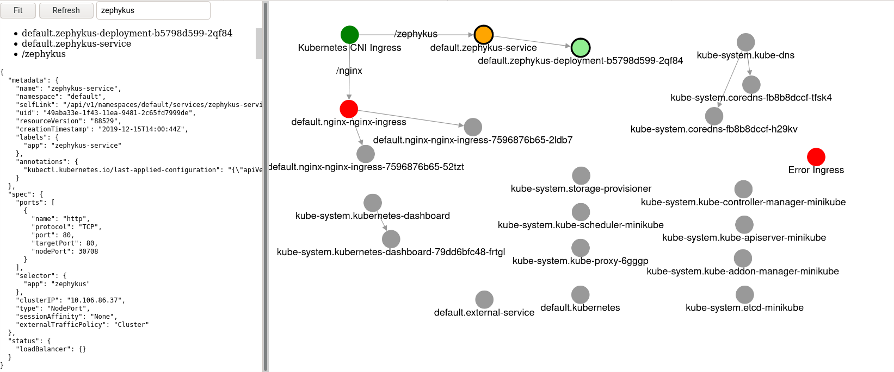

# Zephykus

Zephykus is a tool to visualize ingress rules and flow of network traffic in Kubernetes.



Entrypoint is the *Kubernetes CNI Ingress* node. Two ingress rules are defined (`zephykus` and `nginx`) that redirect traffic to the corresponding services. Based on the kubernetes label selectors, two pods each do match the service description and will receive the traffic.

By clicking on each entity additional information like ingress annotations, port configuration and service types are revealed on the left hand side info box.

Color legend:

- Dark border: Search matches
- Orange: Selected item
- Green:
  - Light: Upstream resources
  - Dark: Downstream resources
- Red: Publicly exposes services (LoadBalancer, NodePort)

## Usage

Install zephykus to your cluster.
```
kubectl apply -f https://raw.githubusercontent.com/timonback/zephykus/master/zephykus.yaml
```

Access the web-interface locally at http://localhost:3000/
```
kubectl -n default port-forward svc/zephykus-service 3000:80
```

## Security

Running this image, will expose the kubernetes raw objects of type pod, service and ingress to the outside world. While manipulation is not possible, many details are reveals to everyone who has access to the service.

As part of installing, also a default ingress resource is created. This rule may allow attackers to access this service even without using the `kubectl port-forward` command.

## Future Improvements

- [x] Faster graph handling with Cytograph
- [ ] Indicate via icons the service resource and additional information like healthiness
- [x] Load new cluster state only on request (including caching) instead of pre-fetching
- [x] Add pod/service/ingress filter
- [x] Add interactive search suggestions
